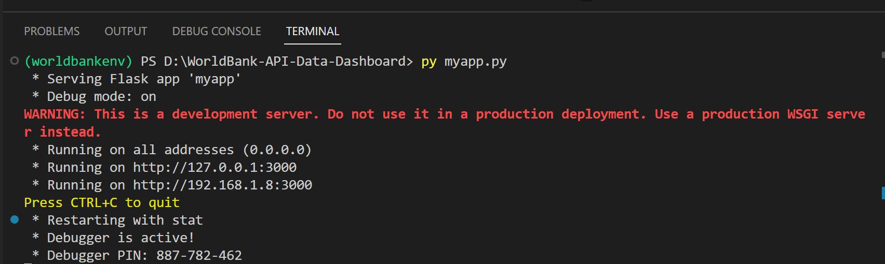

# WorldBank-Data-Dashboard

<br>
<div align="center">

</div>
<br>

### Table of Contents

1. [Installation](#installation)
2. [Project Description](#description)
3. [File Structure](#files)
4. [How to run web app](#instruction)
5. [Learn more](#learnmore)
    - [Other APIs](#other-apis)
    - [Deploy the app to cloud](#deploy-to-cloud)
6. [Licensing, Authors, and Acknowledgements](#licensing)

## 1. Installation <a name="installation"></a>

- The virtual environment [worldbankenv](https://github.com/hongtranthianh/WorldBank-Data-Dashboard/tree/main/worldbankenv) contains all Python packages that the app depends on.
- The code should run with no issues using Python versions 3.*. Currently using `Python 3.11.3` on `Windowns 11`.

## 2. Project Description<a name="description"></a>

Develop and deploy a data dashboard as a web app using Bootstrap, Plotly, and Flask.

Data was pulled directly from the [World Bank API](https://documents.worldbank.org/en/publication/documents-reports/api), clean the data in back-end using pandas ([wrangle_data.py](https://github.com/hongtranthianh/WorldBank-Data-Dashboard/blob/main/wrangling_scripts/wrangle_data.py)) and then display the results on front-end ([index.html](https://github.com/hongtranthianh/WorldBank-Data-Dashboard/blob/main/myapp/templates/index.html)). The benefit is that if the data ever changes, the web app will automatically have the correct data

The output is a functioning flask app that was deployed in local host successfully
<p ></p>

## 3. File Structure <a name="files"></a>

```
- Images # containing images used in README.md

- myapp
|- static  # containing images for front end
|- template
| |- index.html  # main page of web app
|- __init__.py  # entry point for the app
|- routes.py  # make sure correct web address associated with correct html template

- worldbankenv # virtual environment for this project

- wrangling_scripts
|- wrangle_data.py  # Read in data API and set up Plotly plots

- myapp.py # Flask file running the app in local host

- requirements.txt # list all of the Python packages that the app depends on

- README.md
```


## 4. How to run web app  <a name="instruction"></a>
**Step 1**. Pull this repository to your local machine

```
git clone https://github.com/hongtranthianh/WorldBank-API-Data-Dashboard.git
```

<p ></p>

**Step 2**. Create a virtual environment for running this app with Python 3

In Windows:

```
cd worldbank-data-dashboard
```

```
worldbankenv\Scripts\activate
```

<p ></p>

**Step 3**. Run the app locally in the project's root directory

```
python myapp.py
```
or
```
py myapp.py
```

<p ></p>


**Step 4**. Open `http://192.168.1.8:3000`

## 5. Learn more <a name="learnmore"></a>

### 5.1. Other APIs <a name="other-apis"></a>
A few examples of public APIs include the [Twitter API](https://developer.twitter.com/en/docs), the [Google Maps API](https://mapsplatform.google.com/), and the [Facebook Graph API](https://developers.facebook.com/docs/graph-api).

You can pull data from these APIs to create your own application.

### 5.2. Deploy the app to cloud <a name="deploy-to-cloud"></a>

You can go beyond local host by deploying the worldbank dashboard app to [Heroku](https://dashboard.heroku.com/apps). This is going to be written in [next post]()

The big internet companies offer similar services like [Amazon's Lightsail](https://aws.amazon.com/lightsail/), [Microsoft's Azure](https://learn.microsoft.com/en-us/samples/azure-samples/python-docs-hello-world/python-flask-sample-for-azure-app-service-linux/), and [Google Cloud](https://cloud.google.com/appengine/docs/legacy/standard/python/setting-up-environment). However, these services tend to require more configuration. Most of these also come with either a free tier or a limited free tier that expires after a certain amount of time.

## 6. Licensing, Authors, and Acknowledgements <a name="licensing"></a>

Free to use the code here as you would like.
